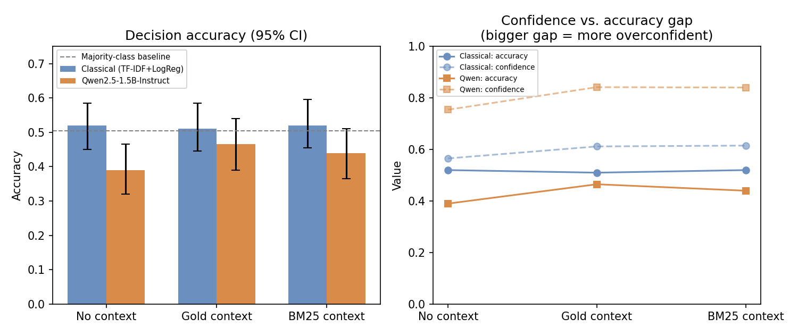
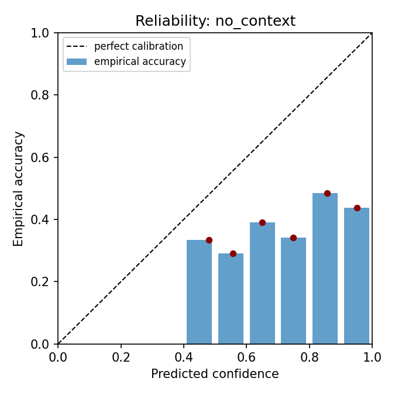
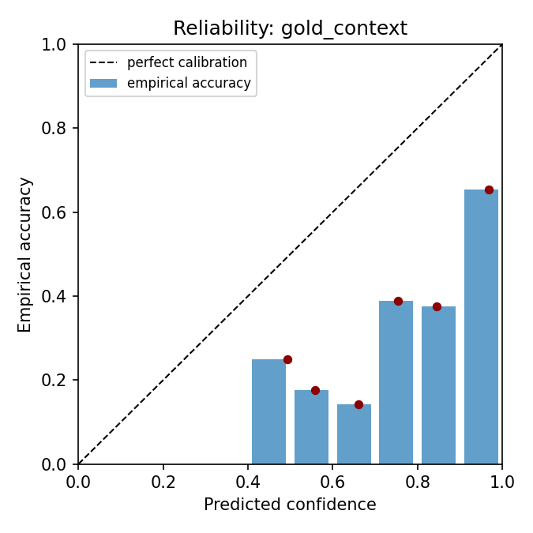
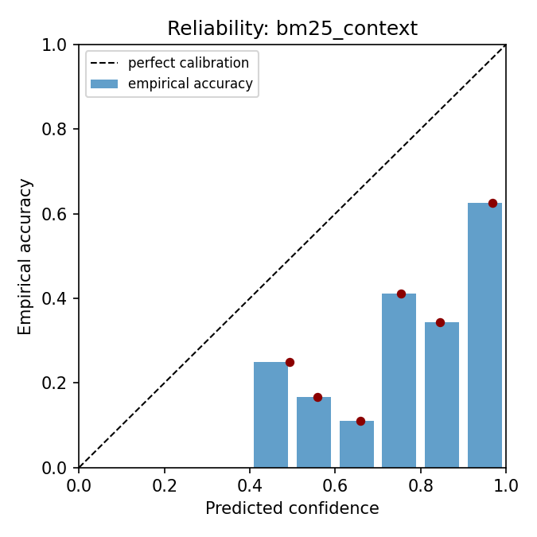

# Biomedical RAG: Trustworthy Evaluation

A retrieval-augmented question-answering pipeline over PubMed abstracts,
evaluated the way a *deployment* decision requires evidence to be
evaluated — not just "does it answer correctly," but does it retrieve the
right evidence, is its confidence trustworthy, and is its answer actually
grounded in what it retrieved.

The retriever is built from TF-IDF/BM25/LSA primitives (no pretrained
embedding weights downloaded), so retrieval evaluation runs anywhere,
offline, in seconds. Generation is evaluated under two independent
generators through the same interface and the same evaluation code: a
classical TF-IDF+logistic-regression classifier (needs no downloads,
runs anywhere) and a real instruction-tuned LLM, Qwen2.5-1.5B-Instruct
(needs a GPU and Hugging Face Hub access, run on Colab). Both are
reported below — the point of this repo is the *evaluation harness* and
what it reveals about each generator, not just running one and declaring
victory.

## Task and data

[PubMedQA](https://github.com/pubmedqa/pubmedqa) (Jin et al., 2019, MIT
license), labeled subset (PQA-L): 1000 PubMed abstracts, each reframed as
a yes/no/maybe research question (derived from the paper's own title) with
expert-annotated answers and the abstract's own conclusion as a long-form
reference answer. We build our own document-level 60/20/20 train/dev/test
split (seed 42) rather than reusing the benchmark's official split, since
that split was designed for classification-only evaluation; retrieval
evaluation additionally needs the other 999 abstracts in the corpus to
serve as distractors for whichever one is the true source document per
question.

```
scripts/download_data.py   # fetches ori_pqal.json from the public GitHub repo
scripts/prepare_data.py    # builds corpus.jsonl + train/dev/test.jsonl
```

## Pipeline

```
question ─▶ retriever ─▶ top-k documents ─▶ generator ─▶ answer + confidence + citation
```

**Retrieval** (`src/retrieval.py`): two independent methods, so retrieval
quality itself is a measured variable rather than assumed:
- `BM25Retriever` — classic lexical ranking.
- `LsaRetriever` — TF-IDF projected through truncated SVD (latent semantic
  analysis), fit on the corpus itself. This is the from-scratch stand-in
  for a neural dense/bi-encoder retriever.

**Generation** (`src/generator.py`): `ExtractiveClassifierGenerator` is a
TF-IDF + logistic-regression classifier over `question [SEP] evidence`,
trained on the train split, producing a probability over {yes, no, maybe}
plus an extracted evidence sentence and an explicit source citation. It
needs no downloaded weights, so every metric below is a real, run-today
number rather than a projection.

**Evaluation** (`src/metrics.py`, `scripts/run_*_eval.py`):
- Retrieval: Recall@{1,3,5,10}, MRR, indexing time, per-query latency —
  each with a bootstrapped 95% CI (1000 resamples), because a point
  estimate on 200 test queries isn't enough to call a winner.
- Generation, under three evidence conditions (no context / gold context /
  BM25-retrieved context, to isolate what retrieval errors cost
  downstream): decision accuracy, Expected Calibration Error, multiclass
  Brier score, and a reliability diagram per condition.
- Faithfulness: a lexical *support ratio* — the fraction of the generated
  answer's content words that also appear in the cited evidence — as a
  cheap, model-free hallucination-risk proxy (see limitations: it is not
  an entailment check).

## Results

Reproduced by `bash scripts/run_all.sh`. n=200 test questions, 1000-document
corpus, seed 42.

**Retrieval** (`results/tables/retrieval_results.csv`):

| retriever | Recall@1 | Recall@5 | MRR | mean latency |
|---|---|---|---|---|
| BM25 | 0.960 [0.930, 0.985] | 0.990 [0.975, 1.00] | 0.974 [0.953, 0.991] | 2.8 ms |
| TF-IDF+LSA (128d) | 0.720 [0.655, 0.785] | 0.900 [0.860, 0.940] | 0.797 [0.750, 0.847] | 1.0 ms |

BM25 wins decisively and with non-overlapping CIs. This is expected, not a
bug: each question is generated from its own abstract's title, so
question and gold document share exact vocabulary — the setting lexical
retrieval is built for. It's still worth measuring rather than assuming:
a semantic/dense retriever's real advantage shows up on paraphrased or
vocabulary-mismatched queries, which this benchmark's question-generation
process doesn't produce. That's a property of the *benchmark*, and a
concrete reason a production system should also be evaluated on queries
written independently of the source text (see Limitations).

**Generation** (`results/tables/generation_results.csv`):

| condition | accuracy [95% CI] | ECE | Brier | mean confidence |
|---|---|---|---|---|
| no context | 0.520 [0.450, 0.585] | 0.079 | 0.602 | 0.565 |
| gold context | 0.510 [0.445, 0.585] | 0.102 | 0.609 | 0.612 |
| BM25-retrieved context | 0.520 [0.455, 0.595] | 0.105 | 0.607 | 0.615 |

The test set's majority-class rate (always predicting "yes") is 0.505 —
so this classifier is, within noise, not beating the majority baseline
*in any condition, including with perfect (gold) retrieval*: the three
accuracy CIs above overlap almost completely with each other and with
0.505, so "no context / gold / BM25 all land around 51-52%" isn't three
numbers that happen to look close, it's a bootstrapped confirmation that
retrieval quality made no measurable difference here. That is the
headline finding, and it's a real negative result, not a bug: PubMedQA's
yes/no/maybe task requires weighing quantitative findings against a
question's framing, which a bag-of-words classifier structurally cannot
do — more/better-retrieved evidence doesn't help a model that cannot use
it. It also gets *more* confident with more context (0.565 → 0.615 mean
confidence) while accuracy is flat, which is exactly the overconfidence
pattern a calibration check exists to catch: ECE roughly doubles from
0.079 to ~0.10 once any evidence is added. The retrieval side of this
pipeline is already solved (BM25 MRR 0.97), so the accuracy ceiling here
is a generator-capability problem — see the classical-vs-LLM comparison
below for what happens when the generator is swapped for a real LLM
(short version: differently limited, not unlimited).

Mean support ratio (cited sentence vs. its source evidence) is exactly
**1.0** in both context conditions. This is trivial by construction, not
a finding: the citation is always a verbatim sentence copied out of the
evidence (see `best_matching_sentence` in `src/generator.py`), so every
one of its content words is guaranteed to appear in that evidence. The
metric is included anyway because it's the same one `HFLocalLLMGenerator`
uses on its own verbatim-sentence citation below — it only becomes
non-trivial once a generator can introduce wording that *isn't* a direct
quote, which an extractive method structurally cannot do.

## Generation: classical baseline vs. a real LLM

`HFLocalLLMGenerator` (`src/generator.py`) swaps the classifier for a
genuine instruction-tuned model (Qwen2.5-1.5B-Instruct), through the same
`GenerationResult` interface, evaluated by the exact same
`evaluate_generator` function (`src/eval_generation.py`) as the classical
baseline — same test set, same three conditions, same metric code, so the
two tables below are apples-to-apples by construction. Two design choices
keep it trustworthy-by-construction rather than just "prompt an LLM and
hope": confidence is the model's own next-token log-probability for
"yes"/"no"/"maybe" (renormalized across just those three), not a
verbalized self-report; and the citation is a sentence *number* the model
picks from the real evidence sentences, mapped back to that exact string
— never free-form generated text — so a citation is always verbatim or
absent, never fabricated.



| condition | accuracy [95% CI] | ECE | Brier | mean confidence |
|---|---|---|---|---|
| **Classical** — no context | 0.520 [0.450, 0.585] | 0.079 | 0.602 | 0.565 |
| **Classical** — gold context | 0.510 [0.445, 0.585] | 0.102 | 0.609 | 0.612 |
| **Classical** — BM25 context | 0.520 [0.455, 0.595] | 0.105 | 0.607 | 0.615 |
| **Qwen2.5-1.5B** — no context | 0.390 [0.320, 0.465] | 0.364 | 0.917 | 0.754 |
| **Qwen2.5-1.5B** — gold context | 0.465 [0.390, 0.540] | 0.377 | 0.846 | 0.842 |
| **Qwen2.5-1.5B** — BM25 context | 0.440 [0.365, 0.510] | 0.400 | 0.877 | 0.840 |

(Full per-condition tables: `results/tables/generation_results.csv` and
`generation_results_llm.csv`; per-query breakdown in
`generation_per_query.csv` / `generation_per_query_llm.csv`.)

Reliability diagrams, one per condition (bars below the diagonal =
overconfident):

| No context | Gold context | BM25 context |
|---|---|---|
|  |  |  |

**The per-query breakdown surfaces a specific failure mode aggregate
accuracy hides.** Across all 600 condition × query pairs, this generator
(Qwen2.5-1.5B-Instruct, this prompt, this dataset) predicts "no" exactly
twice, out of 216 test items whose gold label is "no" across the three
conditions combined. In the gold-context confusion matrix specifically,
of 72 true-"no" queries: 46 are called "yes," 25 "maybe," only 1 "no."
That's most of the model's error mass concentrated in one pattern: **on
this evaluation set, the model showed a strong tendency to avoid the
"no" class**, rather than a generic "the model is imprecise." Note the
deliberate scope of that sentence — this is a property of this model
size, this zero-shot prompt, and this dataset's question phrasing, not a
claim about Qwen models in general or about "no" answers being uniquely
hard for LLMs; a different prompt, model scale, or few-shot setup could
easily shift it. Still, a pattern this concentrated matters more for a
deployment decision than the aggregate accuracy number alone, which is
exactly what a per-query breakdown is for.

**The LLM does not beat the classical baseline on raw accuracy** — it's
below it in every condition, and below the 0.505 majority-class rate too.
That's a genuinely counter-intuitive result worth sitting with rather than
explaining away: a 1.5B zero-shot instruct model is not automatically
better than a bag-of-words classifier at this specific yes/no/maybe task,
and a portfolio piece that only ever showed "the bigger model wins" would
be less informative than one that measured this and reported it plainly.

**But the LLM is doing something the classifier structurally couldn't:
actually responding to evidence quality.** Classical accuracy was flat at
~51-52% across no-context/gold/BM25 — the earlier finding that it wasn't
using retrieved evidence at all. The LLM's accuracy *moves* with evidence
quality, in the expected direction: 39.0% (nothing) → 46.5% (correct
abstract) → 44.0% (BM25's occasional wrong retrieval) → a genuine
retrieval-quality signal the classifier never showed. So the LLM's
generation *mechanism* is the right one for this pipeline; its *absolute*
accuracy on this particular small, zero-shot, 1.5B-parameter setup just
isn't there yet — a testable, specific gap (model scale, few-shot
prompting, or fine-tuning) rather than a vague "LLMs are better."

**Calibration is where the LLM clearly loses.** ECE roughly quadruples
(0.08-0.10 → 0.36-0.40) and Brier score roughly reaches or exceeds the
worst possible value for an uninformative 3-way classifier (mean
confidence ~0.75-0.84 against ~40-47% actual accuracy). The right-hand
panel above shows this directly: the classifier's confidence line tracks
close to its accuracy line, while the LLM's confidence line sits far above
its accuracy line at every condition. This is the central "trustworthy
evaluation" finding of this repo: the more capable-*seeming* generator is
the less trustworthy one by the metric that actually measures
trustworthiness, and a deployment decision based on accuracy alone would
have missed that entirely.

## Reproducing

```bash
pip install -r requirements.txt
bash scripts/run_all.sh                        # offline: retrieval + classical generator
python scripts/plot_classical_vs_llm.py        # regenerate the comparison figure
```

(equivalently: `make install data retrieval generation figure`)

Runs in well under a minute on CPU. For the LLM generator (Colab, GPU
recommended):

```bash
pip install -r requirements-llm.txt
python scripts/run_generation_eval_llm.py --n-test 20   # smoke test first
python scripts/run_generation_eval_llm.py                # full 200
```

`requirements-lock.txt` pins the exact versions used to produce the
committed classical-pipeline results, for a fully deterministic re-run;
`requirements.txt`'s lower bounds are enough for normal use.

## Testing

```bash
pip install -r requirements-dev.txt
pytest -v          # or: make install-dev test
```

38 unit/integration tests (`tests/`) cover every module that runs in this
offline sandbox: retrieval correctness on a synthetic corpus with known
answers (`test_retrieval.py`), known-answer cases for every metric —
perfect calibration → ECE 0, one-hot prediction → Brier 0, negation kept
as a content word in `support_ratio` (`test_metrics.py`) — the classical
generator's fit/predict contract and its verbatim-citation guarantee
(`test_generator.py`), and the shared `evaluate_generator` loop end to
end, including that it raises loudly on a malformed probability vector
rather than silently computing a meaningless calibration score
(`test_eval_generation.py`). `HFLocalLLMGenerator` needs `torch`/
`transformers` and is exercised on Colab instead (see above), so it's
deliberately not imported by anything in `tests/` — CI never needs a GPU.
A GitHub Actions workflow (`.github/workflows/tests.yml`) runs this suite
on every push against Python 3.10 and 3.12.

### A bug the first LLM run caught (kept as a record, not deleted)

The very first end-to-end LLM run produced no-context accuracy of 0.135
with 0.986 confidence — not a capability finding but a prompt bug: the
no-context condition told the model `"(no evidence retrieved)"` while its
system prompt separately said *"if evidence is insufficient, answer
maybe"*, so the model answered "maybe" almost every time regardless of
what it knew (`27/200 = 0.135` is exactly this test split's "maybe" base
rate). Fixed by giving the no-evidence path its own system prompt with no
insufficiency cue (`_build_prompt`'s `has_evidence=False` branch). Two
related fixes landed at the same time: the citation moved from free-form
generation to constrained sentence-number selection (never a fabricated
quote), and the support-ratio metric moved from scoring the full
templated `answer_text` to scoring just the `cited_sentence` (wrapper
words like "Evidence"/"source" were inflating it before). The results
table above is the clean re-run after all three fixes.

## Limitations

- **The LLM tested is small and zero-shot.** Qwen2.5-1.5B-Instruct with
  no few-shot examples and no fine-tuning underperforms the classical
  baseline on raw accuracy (see comparison above) while being far worse
  calibrated. Whether a larger model, few-shot prompting, or task-specific
  fine-tuning closes the accuracy gap (and whether calibration improves
  with it) is the natural next experiment, not yet run here.
- **Retrieval task is easier than production retrieval.** Questions are
  generated from their own source abstract's title, so lexical overlap
  with the gold document is unusually high; BM25's 0.96 Recall@1 should
  not be read as "retrieval is a solved problem" for queries phrased
  independently of their source text (e.g. a clinician's actual question).
- **Support ratio is a lexical proxy, not an entailment check.** It
  penalizes faithful paraphrases that don't reuse the evidence's exact
  wording, and would miss a high-overlap sentence that actually
  contradicts its evidence. A real faithfulness metric for the LLM
  generator should add NLI-based entailment checking.
- **Fairness/subgroup evaluation is out of scope here.** The corpus has no
  patient-level demographic metadata to stratify by (it's abstract-level
  literature, not patient records), so this axis of "trustworthy
  evaluation" is deliberately left to a dataset where it's answerable
  rather than reported against data that can't support it.
- **1000-document corpus is small** relative to a real literature or
  clinical-note retrieval setting; latency numbers here are not
  informative about scaling to millions of documents.

## Repository layout

```
scripts/
  download_data.py        fetch the public PubMedQA labeled subset
  prepare_data.py         build corpus + train/dev/test splits
  run_retrieval_eval.py   BM25 vs. TF-IDF+LSA retrieval evaluation
  run_generation_eval.py  classical-generator eval (runs anywhere, no downloads)
  run_generation_eval_llm.py  real-LLM eval (Colab; see "classical baseline
                          vs. a real LLM" above)
  plot_classical_vs_llm.py    regenerate the comparison figure from the
                          two generation_results*.csv tables
  run_all.sh              run the offline pipeline end-to-end
src/
  retrieval.py       BM25Retriever, LsaRetriever
  generator.py       ExtractiveClassifierGenerator, HFLocalLLMGenerator
  metrics.py         recall@k, MRR, ECE, Brier, reliability bins, support
                     ratio, bootstrap_ci (shared by retrieval + generation)
  eval_generation.py shared no/gold/bm25-context eval loop used by BOTH
                     run_generation_eval.py and run_generation_eval_llm.py,
                     so a baseline-vs-LLM comparison is apples-to-apples by
                     construction (one evaluation implementation, not two
                     that could silently drift apart); also writes a
                     per-query CSV (gold vs. predicted decision, full
                     class_probs, cited sentence) for error analysis, not
                     just the aggregate summary
tests/               pytest suite for everything above that runs offline
                     (retrieval, metrics, classical generator, the shared
                     eval loop) -- see "Testing" above
results/
  tables/     retrieval_results.csv, retrieval_per_query.csv,
              generation_results.csv, generation_per_query.csv,
              generation_results_llm.csv, generation_per_query_llm.csv
              (all committed, all from real runs)
  figures/    reliability_{condition}.png (classical),
              reliability_llm_{condition}.png (Qwen, from the Colab run),
              classical_vs_llm_summary.png (regenerate any of these with
              scripts/run_*_eval*.py / scripts/plot_classical_vs_llm.py)
data/         gitignored; regenerate with scripts/download_data.py + prepare_data.py
```

## Data and license

Data: [PubMedQA](https://pubmed.ncbi.nlm.nih.gov/) labeled subset, via the
[pubmedqa/pubmedqa](https://github.com/pubmedqa/pubmedqa) GitHub
repository (MIT license). If you use PubMedQA, please cite:
Jin, Q., Dhingra, B., Liu, Z., Cohen, W., & Lu, X. (2019). *PubMedQA: A
Dataset for Biomedical Research Question Answering.* EMNLP-IJCNLP 2019.

Code in this repository: MIT license.
